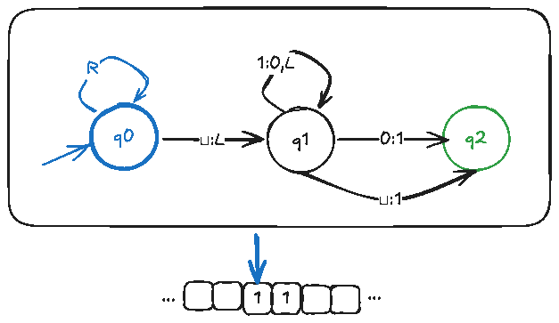

# Foundations of Computer Science

This repository contains Open Education Resources (OER) for a college-level course on the *Foundations of Computer Science*. The material conforms to the [syllabus](syllabus.md) for CS 301 taught at [Lake Washington Institute of Technology](https://www.lwtech.edu) (LWTech) in the Fall of 2025.

## Content

- [Introduction](./content/intro.md)
  - [Theory of Computing](./content/theory/index.md)
  - [Practice of Computing](./content/practice/index.md)
- [Quizzes](./content/quizzes/)
- [Assignments](./content/assignments/)

## Credits

- **LWTech’s OER Development Funding** supported the creation of this content
- The content is based on **reference materials** that include the following:

  1. M. Sipser, *Introduction to the Theory of Computation*
  2. R. Sedgewick, *Computer Science: An Interdisciplinary Approach*

---
